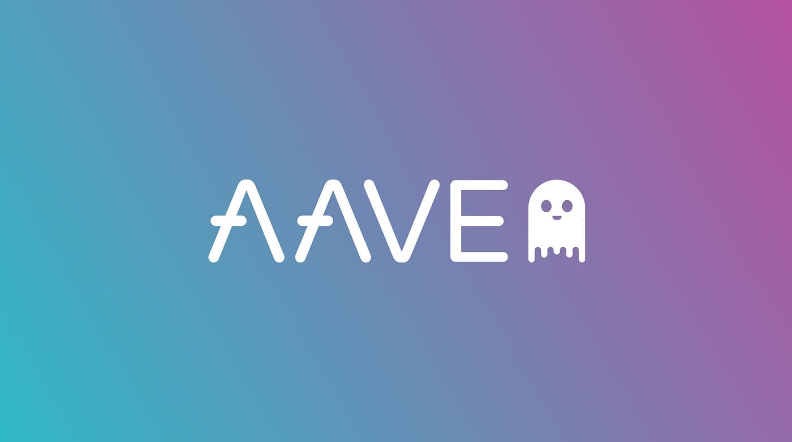

# Aave V2 positions bot



This project demonstrates an Aave V2 on Ethereum Mainnet to keep up to date with the latest user's positions state, it utilizes MySql as a database to store user's reserves details using Prisma ORM.

You may use [Xampp](https://www.apachefriends.org/) to host a local MySql database.


Running the following to fetch block's logs:
```shell
yarn
npm run db-init
npx ts-node .\scripts\main.ts
```

Run to reset the database:
```shell
npm run db-reset
```

Running the following to get the underwater positions status:
```shell
npx ts-node .\scripts\liquidation.ts
```

**Note that the current version is incomplete, you would need to extract the processed user reserves for underwater positions and evaluate them, as well as integrating it with your own smart contract to liquidate unhealthy positions.**